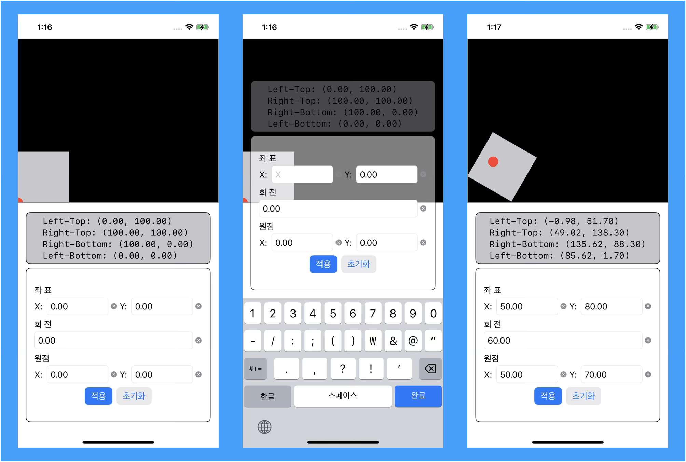

# sungyeon-transformation

2D Transformation 샘플 iOS 앱


도형 변환은 `CGAffineTransform`을 사용하여 이동, 회전, Pivot 보정을 차례대로 적용해 좌표를 계산

```swift
let transform = CGAffineTransform.identity
    .translatedBy(x: position.x, y: position.y)
    .rotated(by: angle)
    .translatedBy(x: -pivot.x, y: -pivot.y)

let globalPoints = localPoints.map { $0.applying(transform) }
```

## 스크린샷



## 기능

- 사각형의 위치, 회전, 피벗 포인트 조정
- 실시간 변환 결과 시각화
- 네 모서리 좌표 표시

## 구조

```
Sources/
├── App/
│   └── TransformationApp.swift         # 메인 앱
├── Model/
│   └── TransformState.swift            # 변환 상태
├── Util/
│   └── TransformGeometry.swift         # 기하학 계산
└── View/
    ├── Canvas/
    │   ├── TransformCanvas.swift       # SwiftUI 래퍼
    │   └── TransformCanvasView.swift   # UIKit 캔버스
    ├── CornerInfoView.swift            # 모서리 좌표 표시
    └── TransformControlPanelView.swift # 입력 컨트롤
```

## 요구사항

- iOS 17.0+
- Xcode 15.0+

## 실행

Xcode에서 프로젝트를 열고 실행하세요.
